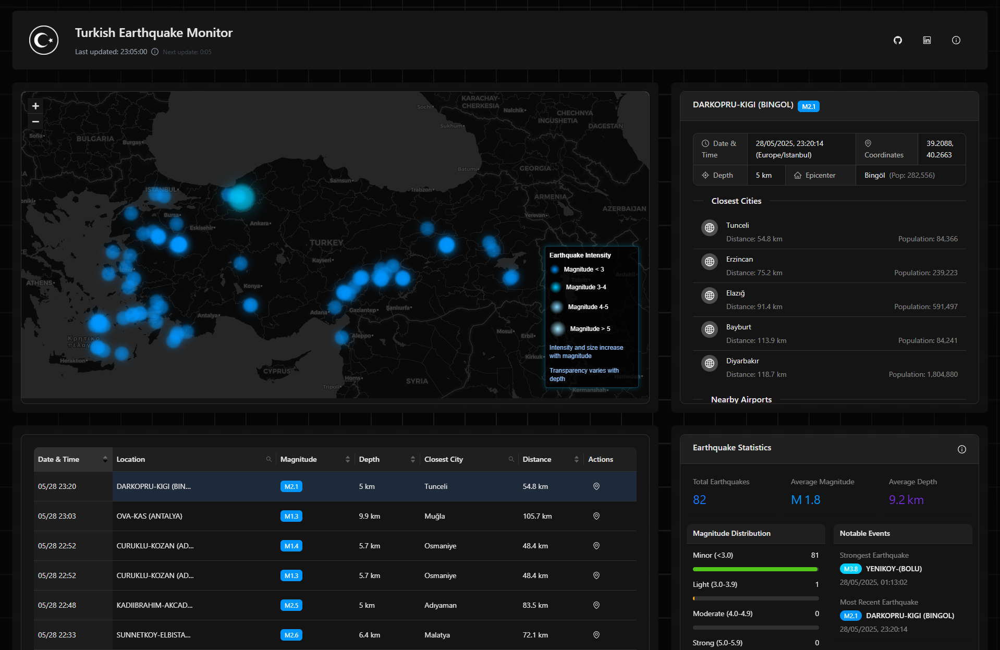

<div align="center">

# 🇹🇷 Turkish Earthquake Monitor

[](https://nextjs.org/)
[](https://www.typescriptlang.org/)
[](https://ant.design/)
[](https://tailwindcss.com/)
[](LICENSE)

**Real-time visualization of earthquake data across Turkey**

[Demo](https://turkish-earthquake-monitor.vercel.app) | [Report Bug](https://github.com/VanColt/Turkish_Earthquake_Monitor/issues) | [Request Feature](https://github.com/VanColt/Turkish_Earthquake_Monitor/issues)

</div>

## ✨ Features

- **Real-time Data**: Visualize the latest earthquake data from across Turkey
- **Interactive Map**: Explore earthquakes with an interactive map featuring gradient markers that indicate magnitude and depth
- **Comprehensive Data Table**: Sort and filter earthquake data with ease
- **Statistical Analysis**: View magnitude distribution and other key metrics
- **Detailed Information**: Get in-depth information about each earthquake, including nearby cities and airports
- **Responsive Design**: Optimized for both desktop and mobile devices

## 🖼️ Screenshots

<div align="center">

</div>

## 🚀 Getting Started

### Prerequisites

- Node.js 18.0 or later
- npm or yarn

### Installation

1. Clone the repository
   ```sh
   git clone https://github.com/VanColt/Turkish_Earthquake_Monitor.git
   ```

2. Install dependencies
   ```sh
   cd Turkish_Earthquake_Monitor
   npm install
   ```

3. Start the development server
   ```sh
   npm run dev
   ```

4. Open [http://localhost:3000](http://localhost:3000) with your browser

## 🛠️ Built With

- [Next.js](https://nextjs.org/) - The React framework
- [TypeScript](https://www.typescriptlang.org/) - For type safety
- [Ant Design](https://ant.design/) - UI component library
- [Tailwind CSS](https://tailwindcss.com/) - For styling
- [Leaflet](https://leafletjs.com/) - For interactive maps
- [Axios](https://axios-http.com/) - For API requests

## 📊 Data Source

This project uses the Kandilli Observatory API provided by [Orhan Aydoğdu](https://github.com/orhanayd). The API provides real-time earthquake data from the Kandilli Observatory and Earthquake Research Institute.

- API Repository: [kandilli-rasathanesi-api](https://github.com/orhanayd/kandilli-rasathanesi-api)

## ⚠️ Disclaimer

**English:**  
Commercial Use Warning:  
The information, data, and maps provided cannot be used for commercial purposes in any way without the written permission and approval of the Rectorate of Boğaziçi University.

**Turkish:**  
Ticari kullanım hakkında uyarı:  
Söz konusu bilgi, veri ve haritalar Boğaziçi Üniversitesi Rektörlüğü'nün yazılı izni ve onayı olmadan herhangi bir şekilde ticari amaçlı kullanılamaz.

## 📄 License

Distributed under the MIT License. See `LICENSE` for more information.

## 🙏 Acknowledgements

- [Orhan Aydoğdu](https://github.com/orhanayd) for providing the Kandilli Observatory API
- [Kandilli Observatory and Earthquake Research Institute](http://www.koeri.boun.edu.tr/) for the earthquake data
- [Boğaziçi University](http://www.boun.edu.tr/) for supporting earthquake research

## 📬 Contact

- GitHub: [@VanColt](https://github.com/VanColt)
- LinkedIn: [Mert Uysal](https://www.linkedin.com/in/mert-uysal/)

---

<div align="center">

Made with ❤️ in Turkey with a hope of never to use it for emergency purposes.

</div>
